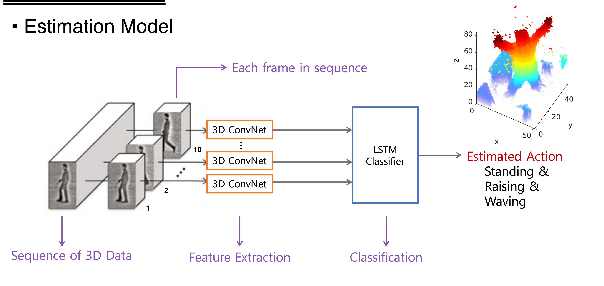
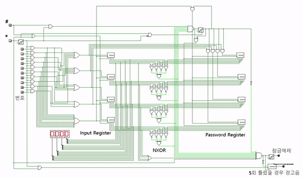
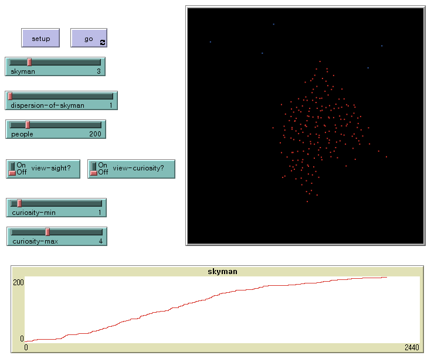
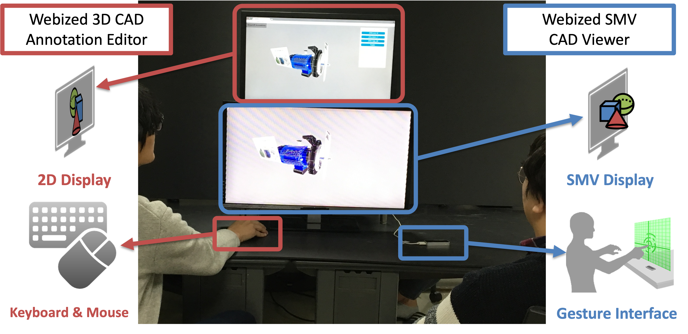
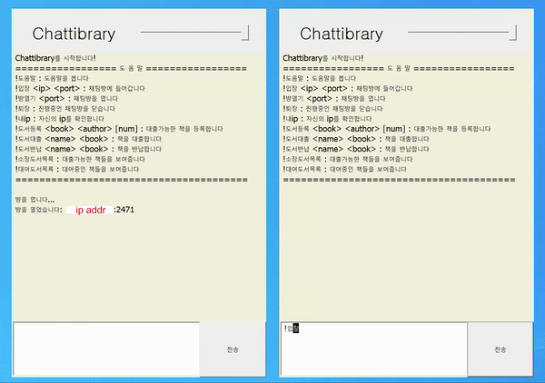
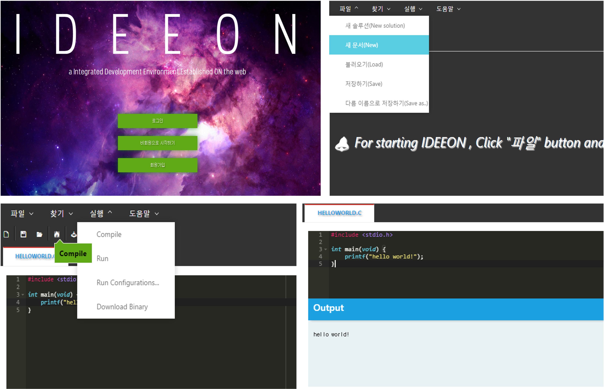
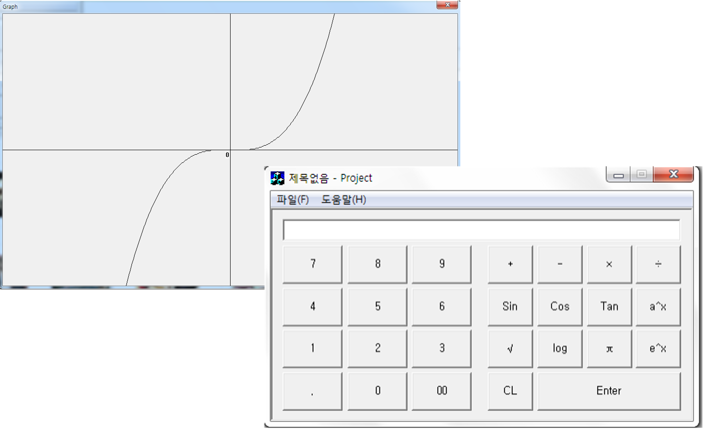

# Yongjae Lee

**Yongjae Lee (이용재)**\
Research Assistant\
[Webizing Research Laboratory (WRL)](https://wrl.kist.re.kr/)\
[Center for Artificial Intelligence](https://cai.kist.re.kr/)\
[Korea Institute of Science and Technology (KIST)](https://eng.kist.re.kr/kist_eng/main/)\
Republic of Korea

**Contact**\
E-mail: [yongjae (dot) lee (at) wrl (dot) onl](mailto:yongjae.lee@wrl.onl)\
[nfyfamraa (at) gmail (dot) com](mailto:nfyfamraa@gmail.com)\
Tel: +82-10-3488-2433\
Homepage: [https://nfyfamr.github.io](https://nfyfamr.github.io)\
Github: [https://github.com/nfyfamr](http://github.com/nfyfamr)\
Linkedin: [https://www.linkedin.com/in/yongjae-lee-nfyfamraa/](https://www.linkedin.com/in/yongjae-lee-nfyfamraa/)

 
## Research Interest
* * *
<dl>
  <dt>Vision & Robotics</dt>
  <dd>3D Reconstruction, Localization and Mapping, Scene Understanding, Autonomous Robot, (Heterogeneous) Multi-robot Collaboration</dd>

  <dt>Graphics & Interface</dt>
  <dd>Virtual Reality (AR) / Augmented Reality (VR), Extended Reality (XR), Human Computer Interface</dd>
</dl>

 
## Education
* * *

- [Yonsei University](https://www.yonsei.ac.kr/en_sc/index.jsp), March 2019 - August 2021
  - Master of Science in Mechanical Engineering
    - Thesis: _Web-based Remote XR Collaboration Using Real-time Digital Twinning of Workspace_ (Advisor: Prof. [Soo-Hong Lee](https://kbd.yonsei.ac.kr/members/faculty) & Dr. [Byounghyun Yoo](https://www.byoo.net/)), 2021 [[Yonsei University Library](https://dcollection.yonsei.ac.kr/public_resource/pdf/000000538823_20211217194008.pdf)]
- [Seoul National University of Science and Technology (SeoulTech)](https://en.seoultech.ac.kr/), March 2011 – February 2018
  - Bachelor of Science in Computer Science and Engineering
    - Capstone Project: UrEgo (a rogue-like 2D top-down view mobile game) [[code](https://github.com/nfyfamr/UrEgo)]

 
## Publication
* * *

### Journal Paper
<!-- [bib] [pdf] [doi] [arXiv] -->
*   Yongjae Lee and Byounghyun Yoo, **XR Collaboration beyond Virtual Reality: Work in the Real World**, Journal of Computational Design and Engineering, 8(2), 756–772, 2021.  
    [[bib](./assets/bib/qwab012.bib)] [[pdf](./assets/pdf/XR_collaboration_beyond_virtual_reality.pdf)] [[doi](https://doi.org/10.1093/jcde/qwab012)]

### Conference Paper (peer reviewed)

*   Yongjae Lee, Byounghyun Yoo, and Soo-Hong Lee, **Sharing Ambient Objects Using Real-time Point Cloud Streaming in Web-based XR Remote Collaboration**, The 26th International Conference on 3D Web Technology (Web3D ’21), November 8–12, 2021, Pisa, Italy.  
    [[bib](./assets/bib/acm_3485444.3487642.bib)] [[pdf](./assets/pdf/sharing_ambient_objects.pdf)] [[doi](https://doi.org/10.1145/3485444.3487642)] [[video](https://youtu.be/1yhrwd10MQA)]

*   Yongjae Lee, Changhyun Moon, Heedong Ko, Soo-Hong Lee, and Byounghyun Yoo, **Unified Representation for XR Content and Its Rendering Method**, The 25th International Conference on 3D Web Technology (Web3D ’20), November 9–13, 2020, Seoul, Korea.  
    [[bib](./assets/bib/acm_3424616.3424695.bib)] [[pdf](./assets/pdf/unified_representation.pdf)] [[doi](https://doi.org/10.1145/3424616.3424695)] [[video](https://youtu.be/pIfZnJZqDFo)]

*   Daeil Seo, Yongjae Lee, and Byounghyun Yoo, **Webizing Interactive CAD Review System Using Super Multiview Autostereoscopic Displays**, HCI International 2017 – Posters’ Extended Abstracts (pp. 62–67). Springer International Publishing, 2017.  
    [[bib](./assets/bib/10.1007_978-3-319-58753-0_10-citation.bib)] [[pdf](./assets/pdf/webizing_interactive_CAD_review_system.pdf)] [[doi](https://doi.org/10.1007/978-3-319-58753-0_10)]

### Presentation [Pr] & Poster [Po] & Tutorial [Tu]
- [Po] (Scheduled) Yeongbeom Hwang, Suyeong Kim, Yongjae Lee, and Byounghyun Yoo, **A method for web-based remote XR collaboration with real-time 360 video and point cloud streaming**, Winter Conference of Society for Computational Design and Engineering, February 9-12, 2022, Jeju

- [Tu] Byounghyun Yoo, Yongjae Lee, and Changhyun Moon, **WXR: Remote Cooperation using WebXR Technology**, The 25th International Conference on 3D Web Technology (Web3D ’20), November 9–13, 2020, Seoul, Korea

- [Pr] Seungyeon Huh, Yongjae Lee, Heedong Ko, and Byounghyun Yoo, **Decentralized architecture and its application of WebXR for scalability of concurrent collaboration in XR environments**, Winter Conference of Society for Computational Design and Engineering, January 23–26, 2019, Pyeongchang, Korea

- [Po] Yongjae Lee, Byounghyun Yoo, and Heedong Ko, **A WebXR-based method for asymmetric collaboration between local users and remote subject-matter experts**, Summer Conference of Society for Computational Design and Engineering, August 21–24, 2018, Jeju, Korea **“Best Poster Award”**

- [Po] Jongho Lee, Daeil Seo, Byounghyun Yoo, Heedong Ko, and Yongjae Lee, **Augmented reality-based maintenance system using Web technologies**, Winter Conference of Society for Computational Design and Engineering, January 23–26, 2018, Hoengseong, Korea

- [Po] Wanho Im, Jongho Lee, Yongjae Lee, Daeil Seo, and Byounghyun Yoo, **Personalized sleep environment control system using IoT**, Summer Conference of Society for Computational Design and Engineering, August 17–18, 2017, Seoul, Korea

- [Pr] Yongjae Lee, Daeil Seo, Doyeon Kim, and Byounghyun Yoo, **Interactive CAD Review System for Super Multiview Autostereoscopic Displays based on Web Technologies**, Winter Conference of Society for Computational Design and Engineering, February 8–10, 2017, Pyeongchang, Korea

### Patents
- (In progress) Yongjae Lee and Byounghyun Yoo, **Method and Apparatus for XR content generation using point cloud filtering through comparison with a 3D model**, Republic of Korea

- Yongjae Lee and Byounghyun Yoo, **Method and Apparatus for entity tracking based on feature data independent of augmented reality engine**, Republic of Korea, 2021, Patent No. 10-2021-0009217

- Yongjae Lee and Byounghyun Yoo, **Method and device for providing virtual content on virtual space based on common coordinate**, United States, 2021, Patent No. 17/607,402

- Yongjae Lee and Byounghyun Yoo, **Integrated rendering method for various extended reality modes and device having thereof**, United States, 2020, Patent No. [17/036,119](https://patentimages.storage.googleapis.com/54/00/95/2f47c67da24e6f/US20210174602A1.pdf)

 
## Project
* * *

<table>
  <tr>
    <td width="30%"></td>
    <td>
      <b>Autonomous driving project</b>
      <ul>
        <li>August 2021 - September 2021</li>
        <li>Team project in the Autonomous Driving course in Grepp, Inc.</li>
        <li>Developed an autonomous driving system for a remote control car</li>
        <li>Main contribution: SLAM tuning, image recognition, 3D visualization</li>
        <li>Funded by the Ministry of Employment and Labor (MOEL)</li>
      </ul>
      Tag: Self-driving, SLAM, Computer Vision  
      <a href="https://github.com/nfyfamr/xytron-final-project">[code]</a>
      <a href="https://www.youtube.com/watch?v=8LzUUPVyS1I&t=2090s">[video]</a>
    </td>
  </tr>
  <tr>
    <td></td>
    <td>
      <b>Digital twinning of a physical environment in XR collaboration</b>
      <ul>
        <li>December 2020 - July 2021</li>
        <li>Yonsei University, Seoul, Republic of Korea</li>
        <li>The implementation for master’s thesis</li>
        <li>Developed a collaboration system that shares the information of an AR user’s physical environment using LiDAR in real time</li>
        <li>Advisor: Prof. Soo-Hong Lee and Dr. Byounghyun Yoo</li>
      </ul>
      Tag: XR Collaboration, Real-time 3D Scanning & Streaming  
      <a href="https://youtu.be/usdNrlUuNc8">[video]</a>
    </td>
  </tr>
  <tr>
    <td></td>
    <td>
      <b>Human Pose Element Estimator</b>
      <ul>
        <li>April 2020 - June 2020</li>
        <li>Yonsei University, Seoul, Republic of Korea</li>
        <li>The final project of the Estimation Theory class</li>
        <li>Developed a human pose element estimator using 3D ConvNet and LSTM</li>
      </ul>
      Tag: Deep Learning, 3D Recognition  
      <a href="./assets/pdf/estimation_theory_class_report.pdf">[class report]</a>
    </td>
  </tr>
  <tr>
    <td></td>
    <td>
      <b>Agile Maintenance Platform using Asymmetric Collaborative 3D Printing for Weapons System</b>
      <ul>
        <li>August 2016 - July 2019</li>
        <li>Korea Institute of Science and Technology</li>
        <li>Developed a web-based XR remote maintenance platform</li>
        <li>Project inspector: Dr. Byounghyun Yoo</li>
        <li>Funded by the National Research Council of Science and Technology (NST)</li>
      </ul>
      Tag: XR Collaboration, Web-based XR  
      <a href="https://wrl.kist.re.kr/35066bb0-10e6-46d9-9873-225d43d79527">[project]</a>
      <a href="https://youtu.be/3A6jsKpkoYc">[video1]</a>
      <a href="https://youtu.be/Mk7Ukg8SvKw">[video2]</a>
    </td>
  </tr>
  <tr>
    <td></td>
    <td>
      <b>Capstone Project: UrEgo</b>
      <ul>
        <li>March 2017 - December 2017</li>
        <li>Seoul National University of Science and Technology</li>
        <li>Developed a rogue-like 2D top-down view mobile game</li>
      </ul>
      Tag: Mobile Game, Unity5  
      <a href="https://github.com/nfyfamr/UrEgo">[code]</a>
      <a href="https://youtu.be/RxZdg_eTrm0">[video]</a>
    </td>
  </tr>
  <tr>
    <td></td>
    <td>
      <b>Bitcoin Price Predictor</b>
      <ul>
        <li>November 2017 - December 2017</li>
        <li>Seoul National University of Science and Technology</li>
        <li>The final project of the Big data Analysis class</li>
        <li>Tested various prediction models for bitcoin price</li>
      </ul>
      Tag: Big data Analysis, Linear Regression, LSTM
    </td>
  </tr>
  <tr>
    <td></td>
    <td>
      <b>Digital Door Lock Circuit Design</b>
      <ul>
        <li>September 2017 - December 2017</li>
        <li>Seoul National University of Science and Technology</li>
        <li>The final project of the Computer System Design class</li>
        <li>Designed a digital door lock circuit</li>
      </ul>
      Tag: Digital Logic Design, Circuit Design  
      <a href="https://github.com/nfyfamr/Digital-Door-Lock-Circuit-Design.git">[code]</a>
      <a href="https://youtu.be/hygwYktAstk">[video]</a>
    </td>
  </tr>
  <tr>
    <td></td>
    <td>
      <b>Webized 3D Content Streaming System for Autostereoscopic 3D Displays</b>
      <ul>
        <li>May 2017 - June 2017</li>
        <li>Korea Institute of Science and Technology</li>
        <li>Developed a practical application with a super multiview autostereoscopic display (SMV display)</li>
        <li>Project inspector: Dr. Byounghyun Yoo</li>
        <li>Funded by the Ministry of Science, ICT and Future Planning (MSIP)</li>
      </ul>
      Tag: Webizing, RGBD Streaming, SMV Display  
      <a href="https://youtu.be/OSt0SvfIjGE">[video]</a>
    </td>
  </tr>
  <tr>
    <td></td>
    <td>
      <b>Rule of Three</b>
      <ul>
        <li>May 2017 - June 2017</li>
        <li>Seoul National University of Science and Technology</li>
        <li>The final project of the Intelligent System Software</li>
        <li>Simulate the rule of three in the crowd psychology, using NetLogo</li>
      </ul>
      Tag: Agent-based Modeling, NetLogo
    </td>
  </tr>
  <tr>
    <td></td>
    <td>
      <b>Morse Code Translator Program</b>
      <ul>
        <li>May 2017 - June 2017</li>
        <li>Seoul National University of Science and Technology</li>
        <li>The final project of the Embedded Software</li>
        <li>Developed a morse code translator program for X-Hyper270A board and Cholesteric LCD (CLCD) display</li>
      </ul>
      Tag: Embedded Software Programming, CLCD  
      <a href="https://github.com/nfyfamr/Embedded-Morse-Code-Translator">[code]</a>
      <a href="https://youtu.be/ELX8GAhnbjE">[video]</a>
    </td>
  </tr>
  <tr>
    <td></td>
    <td>
      <b>Web-based CAD Review System with Autostereoscopic 3D Display</b>
      <ul>
        <li>January 2017 - February 2017</li>
        <li>Korea Institute of Science and Technology</li>
        <li>Developed a practical application with a super multiview autostereoscopic display (SMV display)</li>
        <li>Project inspector: Dr. Byounghyun Yoo</li>
        <li>Funded by the Ministry of Science, ICT and Future Planning (MSIP)</li>
      </ul>
      Tag: Webizing, VR Collaboration, Hand Tracking Interface, SMV Display  
      <a href="https://youtu.be/ieRdG43swqE">[video]</a>
    </td>
  </tr>
  <tr>
    <td></td>
    <td>
      <b>Interactive 3D Dodge Game with Autostereoscopic 3D Display</b>
      <ul>
        <li>December 2016 - January 2017</li>
        <li>Korea Institute of Science and Technology</li>
        <li>Developed a practical application with a super multiview autostereoscopic display (SMV display)</li>
        <li>Project inspector: Dr. Byounghyun Yoo</li>
        <li>Funded by the Ministry of Science, ICT and Future Planning (MSIP)</li>
      </ul>
      Tag: Webizing, Face Tracking Game, SMV Display
    </td>
  </tr>
  <tr>
    <td></td>
    <td>
      <b>Chattibrary</b>
      <ul>
        <li>May 2016 - June 2016</li>
        <li>Seoul National University of Science and Technology</li>
        <li>The final project of the Windows Programming class</li>
        <li>Developed a chatting-interface-based book management system, using Microsoft Foundation Classes (MFC)</li>
      </ul>
      Tag: Windows Application Programming, MFC
    </td>
  </tr>
  <tr>
    <td></td>
    <td>
      <b>Fun Funding : Crowd Funding Web Site</b>
      <ul>
        <li>May 2016 - May 2016</li>
        <li>Seoul National University of Science and Technology</li>
        <li>Team project conducted in the Web Programming class</li>
        <li>Role: client-side UI development</li>
        <li>Developed a crowdfunding platform web site</li>
      </ul>
      Tag: Web Programming, Client-side UI design
    </td>
  </tr>
  <tr>
    <td></td>
    <td>
      <b>Integrated Development Environment Established ON the web (IDEEON)</b>
      <ul>
        <li>November 2015 - December 2015</li>
        <li>Seoul National University of Science and Technology</li>
        <li>Team project conducted in the Advanced Web Programming class</li>
        <li>Role: system design, REST API design, server development, client UI </li>
        <li>Developed a cloud-based C++/Java development environment</li>
      </ul>
      Tag: Web-based IDE
    </td>
  </tr>
  <tr>
    <td></td>
    <td>
      <b>Graphing Calculator</b>
      <ul>
        <li>October 2011 - November 2011</li>
        <li>Seoul National University of Science and Technology</li>
        <li>Team project conducted in the Introduction to Programming(2) class</li>
        <li>Role: main developper</li>
        <li>Developed a calculator that draws a graph of the equation entered by the user, using Microsoft Foundation Classes
(MFC)</li>
      </ul>
      Tag: Windows Application Programming, MFC
    </td>
  </tr>
</table>
