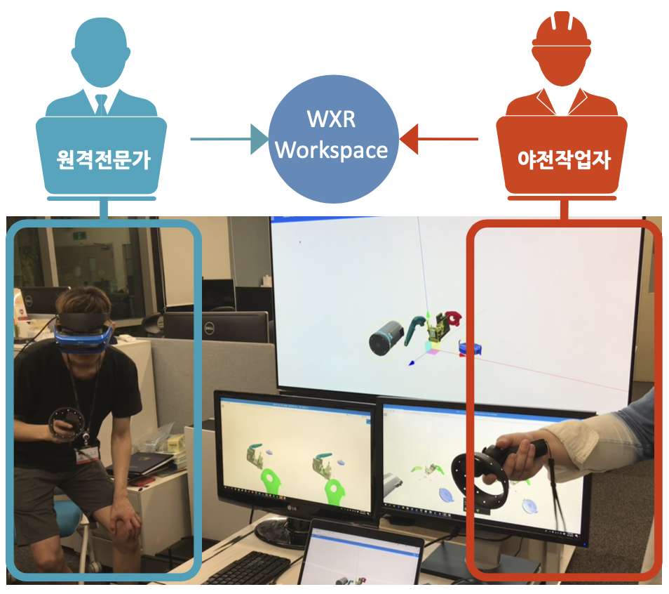
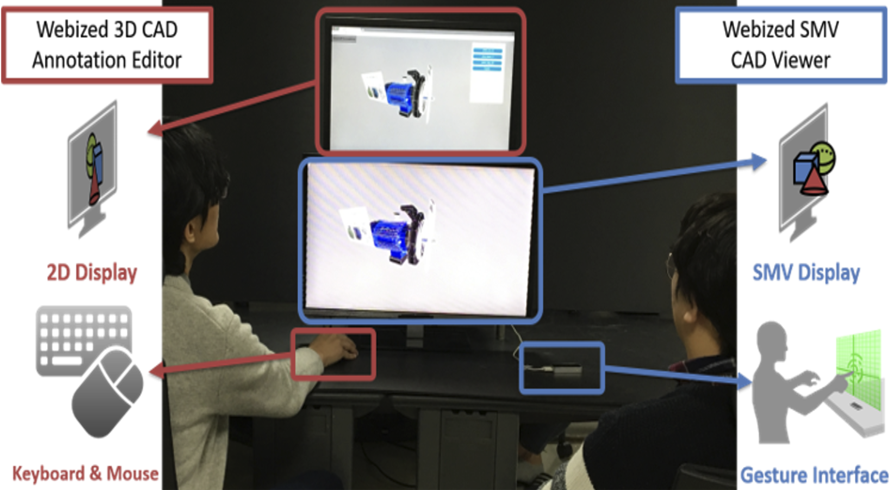

# Yongjae Lee
<!-- Text can be **bold**, _italic_, or ~~strikethrough~~. -->


**Yongjae Lee (이용재)**\
Research Intern\
Webizing Research Laboratory (WRL)\
Center for Artificial Intelligence\
Korea Institute of Science and Technology (KIST)\
Republic of Korea

**Contact**\
E-mail: yongjae (dot) lee (at) wrl (dot) onl\
nfyfamraa (at) gmail (dot) com\
Tel: +82-10-3488-2433\
Homepage: [https://nfyfamr.github.io](https://nfyfamr.github.io)\
Github: [https://github.com/nfyfamr](http://github.com/nfyfamr)\
Linkedin: [https://www.linkedin.com/in/yongjae-lee-nfyfamraa/](https://www.linkedin.com/in/yongjae-lee-nfyfamraa/)


<br>
## Research Interest
* * *
<dl>
  <dt>Vision & Robotics</dt>
  <dd>3D Reconstruction, Localization and Mapping, Scene Understanding, Autonomous Robot, Multi-robot Collaboration</dd>

  <dt>Graphics & Interface</dt>
  <dd>Virtual Reality (AR) / Augmented Reality (VR), Extended Reality (XR), Human Computer Interface</dd>
</dl>


<br>
## Education
* * *

- [Yonsei University](https://www.yonsei.ac.kr/en_sc/index.jsp), March 2019 - August 2021
  - Master of Science in Mechanical Engineering
    - Thesis: _Web-based Remote XR Collaboration Using Real-time Digital Twinning of Workspace_ (Advisor: Prof. [Soo-Hong Lee](https://kbd.yonsei.ac.kr/members/faculty) & Dr. [Byounghyun Yoo](https://www.byoo.net/)), 2021 [Yonsei University Library](https://dcollection.yonsei.ac.kr/public_resource/pdf/000000538823_20211217194008.pdf)
- [Seoul National University of Science and Technology (SeoulTech)](https://en.seoultech.ac.kr/), March 2011 – February 2018
  - Bachelor of Science in Computer Science and Engineering
    - Uerego


<br>
## Publication
* * *

### Journal Paper
<!-- [bib] [pdf] [doi] [arXiv] -->
*   Yongjae Lee and Byounghyun Yoo, **XR Collaboration beyond Virtual Reality: Work in the Real World**, Journal of Computational Design and Engineering, 8(2), 756–772, 2021.  
    [[bib](./assets/bib/qwab012.bib)] [[pdf](https://watermark.silverchair.com/qwab012.pdf?token=AQECAHi208BE49Ooan9kkhW_Ercy7Dm3ZL_9Cf3qfKAc485ysgAAAsEwggK9BgkqhkiG9w0BBwagggKuMIICqgIBADCCAqMGCSqGSIb3DQEHATAeBglghkgBZQMEAS4wEQQMDyRo7r3X25FXIqZvAgEQgIICdNRt4x-YYPJehUFJDJAwR8724SIlpp8aXz0q2XofXKSj8Xre86A06vKH4XWc_0hZGKGV62cyGSrv6FbIxGeyQhbllfYE0vLEuIFHM3hd3-xRFDkmrlvZnIRYKsaavS0NlE0jafzUs98ie0ZqmYlGC4Ps8vtX2Q3xdEKaPe_tdWVLjxK1E28_05y0IycqijLTC639z8LKxmWq6xUBZpY9B2-24p-Eoz8AH2iTOXhVPZ5ytfJloNyZ4hJzo7sIGLl0ZtcnYlkwUvueBoz18-tJpG7PUM6sdklltyInGlnyR19rSh82v72dhvKPKjiK350Q3Aa34PfZ0TcxC8Ll6ASnG1oJNPIeZECiqrmleF0JayjOBArBw0I_i8K6zTBnq9rithhvGur49Wu4UCKhFfhDt7cUiSQFuWg3FINph3_13KUVxYXW2xxHvmORXeCkNzZ5iwfrcZmy9s_27-MvwufoGBIAd4ysODkKkik2n6wyRU_JD73WdtEJURcXHcnxH18rPhxADkFOt-3sPjSNCUAGCGzQYekD4IbI45v0muhAAsi-zNMXKuYnMCU9xbG80jgHif0HrTJnBOwkvwE1CdaicdqpOs68awwU_oT_iDhyjPbbCHifu8m4Xym74S8EhHary14MGZ32vlZBEXa3tuodGH7gUzlRfFAunKsQhrKpxnLq9zHjtSf8Ah6NGGnQKjE5OpW2qzHncz7coGRummn33r2F7d5qCZZenzrkr5KhU77yZx3Fsar22mLIe8hQY-IRFPkur6WQ3DQyT9bBTWtbNANdtYYtkB5-VyF97eFDXwKIAamBedHLU_zLpS7uGHVfVph90XI)] [[doi](https://doi.org/10.1093/jcde/qwab012)]

### Conference Paper (peer reviewed)

*   Yongjae Lee, Byounghyun Yoo, and Soo-Hong Lee, **Sharing Ambient Objects Using Real-time Point Cloud Streaming in Web-based XR Remote Collaboration**, The 26th International Conference on 3D Web Technology (Web3D ’21), November 8–12, 2021, Pisa, Italy.  
    [[bib](./assets/bib/acm_3485444.3487642.bib)] [[pdf](https://dl.acm.org/doi/pdf/10.1145/3485444.3487642)] [[doi](https://doi.org/10.1145/3485444.3487642)]

*   Yongjae Lee, Changhyun Moon, Heedong Ko, Soo-Hong Lee, and Byounghyun Yoo, **Unified Representation for XR Content and Its Rendering Method**, The 25th International Conference on 3D Web Technology (Web3D ’20), November 9–13, 2020, Seoul, Korea.  
    [[bib](./assets/bib/acm_3424616.3424695.bib)] [[pdf](https://dl.acm.org/doi/pdf/10.1145/3424616.3424695)] [[doi](https://doi.org/10.1145/3424616.3424695)]

*   Daeil Seo, Yongjae Lee, and Byounghyun Yoo, **Webizing Interactive CAD Review System Using Super Multiview Autostereoscopic Displays**, HCI International 2017 – Posters’ Extended Abstracts (pp. 62–67). Springer International Publishing, 2017.  
    [[bib](./assets/bib/10.1007_978-3-319-58753-0_10-citation.bib)] [[pdf](https://link.springer.com/content/pdf/10.1007%2F978-3-319-58753-0_10.pdf)] [[doi](https://doi.org/10.1007/978-3-319-58753-0_10)]


### Presentation [Pr] & Poster [Po] & Tutorial [Tu]
    1. [Tu] Byounghyun Yoo, Yongjae Lee, and Changhyun Moon, WXR: Remote Cooperation using WebXR Technology, The 25th International Conference on 3D Web Technology (Web3D ’20), November 9–13, 2020,
    Seoul, Korea
    2. [Pr] Seungyeon Huh, Yongjae Lee, Heedong Ko, and Byounghyun Yoo, Decentralized architecture and its
    application of WebXR for scalability of concurrent collaboration in XR environments, Winter Conference
    of Society for Computational Design and Engineering, January 23–26, 2019, Pyeongchang, Korea
    3. [Po] Yongjae Lee, Byounghyun Yoo, and Heedong Ko, A WebXR-based method for asymmetric collaboration between local users and remote subject-matter experts, Summer Conference of Society for Computational
    Design and Engineering, August 21–24, 2018, Jeju, Korea “Best Poster Award”
    4. [Po] Jongho Lee, Daeil Seo, Byounghyun Yoo, Heedong Ko, and Yongjae Lee, Augmented reality-based
    maintenance system using Web technologies, Winter Conference of Society for Computational Design and
    Engineering, January 23–26, 2018, Hoengseong, Korea
    5. [Po] Wanho Im, Jongho Lee, Yongjae Lee, Daeil Seo, and Byounghyun Yoo, Personalized sleep environment
    control system using IoT, Summer Conference of Society for Computational Design and Engineering, August
    17–18, 2017, Seoul, Korea
    6. [Pr] Yongjae Lee, Daeil Seo, Doyeon Kim, and Byounghyun Yoo, Interactive CAD Review System for Su-
    per Multiview Autostereoscopic Displays based on Web Technologies, Winter Conference of Society for Computational Design and Engineering, February 8–10, 2017, Pyeongchang, Korea


### Patents
    1. Yongjae Lee and Byounghyun Yoo, Method and Apparatus for XR content generation using point cloud filtering through comparison with a 3D model, Republic of Korea (In progress)
    2. Yongjae Lee and Byounghyun Yoo, Method and Apparatus for entity tracking based on feature data independent of augmented reality engine, Republic of Korea, 2021, Patent No. 10-2021-0009217
    3. Yongjae Lee and Byounghyun Yoo, Method and device for providing virtual content on virtual space based on common coordinate, United States, 2021, Patent No. 17/607,402
    4. Yongjae Lee and Byounghyun Yoo, Integrated rendering method for various extended reality modes and device having thereof, United States, 2020, Patent No. 17/036,119


<br>
## Project
* * *

<table>
  <tr>
    <td width="30%"></td>
    <td>
      <b>Autonomous driving project</b>
      <ul>
        <li>The team project of the Autonomous Driving course in Grepp, Inc.</li>
        <li>Developed an autonomous driving system for a remote control car</li>
        <li>Main contribution: SLAM tuning, image recognition, 3D visualization</li>
        <li>Funded by the Ministry of Employment and Labor (MOEL)</li>
      </ul>
    </td>
  </tr>
  <tr>
    <td></td>
    <td>
      <b>Digital twinning of a physical environment in XR collaboration</b>
      <ul>
        <li>Yonsei University, Seoul, Republic of Korea</li>
        <li>The implementation for master’s thesis</li>
        <li>Developed a collaboration system that shares the information of an AR user’s physical environment using LiDAR in real time</li>
        <li>Advisor: Prof. Soo-Hong Lee and Dr. Byounghyun Yoo</li>
      </ul>
    </td>
  </tr>
  <tr>
    <td></td>
    <td>
      <b>Human Pose Element Estimator</b>
      <ul>
        <li>Yonsei University, Seoul, Republic of Korea</li>
        <li>The final project of the Estimation Theory course</li>
        <li>Developed a human pose element estimator using 3D ConvNet and LSTM</li>
        <li>Funded by the Ministry of Employment and Labor (MOEL)</li>
      </ul>
    </td>
  </tr>
  <tr>
    <td></td>
    <td>
      <b>Agile Maintenance Platform using Asymmetric Collaborative 3D Printing for Weapons System</b>
      <ul>
        <li>Korea Institute of Science and Technology, Seoul, Republic of Korea</li>
        <li>Developed a web-based XR remote maintenance platform</li>
        <li>Project inspector: Dr. Byounghyun Yoo</li>
        <li>Funded by the National Research Council of Science and Technology (NST)</li>
      </ul>
    </td>
  </tr>
  <tr>
    <td></td>
    <td>
      <b>Cross-Ministry Giga KOREA Project</b>
      <ul>
        <li>Korea Institute of Science and Technology, Seoul, Republic of Korea</li>
        <li>Developed a dodge game and a web-based CAD review system, using super multiview autostereoscopic displays</li>
        <li>Project inspector: Dr. Byounghyun Yoo</li>
        <li>Funded by the Ministry of Science, ICT and Future Planning (MSIP)</li>
      </ul>
    </td>
  </tr>
</table>

<!--
## Header 2

> This is a blockquote following a header.
>
> When something is important enough, you do it even if the odds are not in your favor.

### Header 3

```js
// Javascript code with syntax highlighting.
var fun = function lang(l) {
  dateformat.i18n = require('./lang/' + l)
  return true;
}
```


### There's a horizontal rule below this.

* * *

### Here is an unordered list:

*   Item foo
*   Item bar
*   Item baz
*   Item zip


```
Long, single-line code blocks should not wrap. They should horizontally scroll if they are too long. This line should be long enough to demonstrate this.
```

```
The final element.
``` -->
